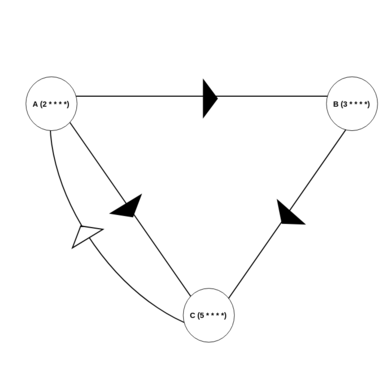
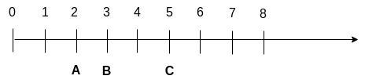

# Djag Scheduler

**(Dj)ango Task D(AG) (Scheduler)**

## Overview

- Djag scheduler associates scheduling information with the celery tasks
- The task schedule is persisted in the database using Django ORM
- Djag scheduler supports task dependencies
- Djag scheduler can handle misfire events
- The schedules can be managed through the Django admin interface
- Djag scheduler adopts event driven approach

## Quick Setup

1. Install djag-scheduler from [``pypi``](https://pypi.org/project/djag-scheduler)

    ```shell
    pip install djag-scheduler
    ```

2. Add [``djag_scheduler``](https://github.com/m0hithreddy/djag-scheduler),
   [``timezone_field``](https://github.com/mfogel/django-timezone-field),
   [``django_json_widget``](https://github.com/jmrivas86/django-json-widget) (installed by default)
   to the Django INSTALLED_APPS

   ```python
   INSTALLED_APPS = [
        ...,
        
        # Djag Scheduler Apps
        'timezone_field',
        'django_json_widget',
        'djag_scheduler'
   ]
   ```
   
3. It is highly recommended to configure [``Django Timezone``](https://docs.djangoproject.com/en/dev/ref/settings/#use-tz)
   since djag-scheduler relies on Django ORM.

   ```python
   USE_TZ = True
   ```

4. [Optional Configurations](#optional-configurations) (In Django project settings).
   
   ```python
   ...
   
   # Djag Scheduler Configuration
   [CELERY_NAMESPACE]_TIMEZONE = 'UTC'
   DJAG_MAX_WAIT_INTERVAL = 0
   DJAG_SYNC_RETRY_INTERVAL = 600
   DJAG_KOMBU_CONN_ARGS = {}
   DJAG_EVENT_QUEUE_NAME = 'DJAG_EVENT_QUEUE-8763051701'
   ```

5. Run migrations

   ```shell
   python manage.py migrate
   ```

Now you can run the server, navigate to the Django admin interface and start creating schedules.

> **Note:** This creates the schedules for the djag-scheduler, and this alone will not run the tasks. 
> See [Running Celery Services](#running-celery-services) for the schedule execution

## Running Celery Services

Djag Scheduler provides a [custom scheduler class](https://docs.celeryproject.org/en/stable/userguide/periodic-tasks.html#using-custom-scheduler-classes)
which can be used with the celery services.

1. [Configure celery](https://docs.celeryproject.org/en/stable/django/first-steps-with-django.html)
   in your Django project and add [celery tasks](https://docs.celeryproject.org/en/stable/django/first-steps-with-django.html#using-the-shared-task-decorator)
   

2. Run celery worker service from the Django project root

   ```shell
   celery -A [project_name] worker --loglevel=info
   ```
   
3. Run celery beat service from the Django project root

   ```shell
   celery -A [project_name] beat -l info --scheduler djag_scheduler.scheduler:DjagScheduler 
   ```

Djag Scheduler will fetch the schedules from the database and starts executing the tasks. Both worker and 
beat services can be started in [one process](https://django-celery-beat.readthedocs.io/en/latest/#example-running-periodic-tasks).
Services can be [daemonized](https://docs.celeryproject.org/en/stable/userguide/daemonizing.html) as well

## Optional Configurations

- **[[CELERY_NAMESPACE]_TIMEZONE](https://docs.celeryproject.org/en/stable/django/first-steps-with-django.html)**:
  Djag scheduler uses the same default timezone the celery is configured to use (Timezone can be configured per crontab).
  **Default**: ``UTC``
  

- **DJAG_MAX_WAIT_INTERVAL**: Defines how long scheduler can be stuck in await of an event. Non-positive values will tell 
  the scheduler to wait for events indefinitely (Djag scheduler can be completely event driven). **Default (sec)**: ``0``

  
- **DJAG_SYNC_RETRY_INTERVAL**: The interval for retrying the sync from Python to DB for sync-failed tasks (Djag scheduler
  continuously syncs the task metadata like last-cron, exceptions, run-counts, etc...). **Default (sec)**: ``600``

  
- **DJAG_KOMBU_CONN_ARGS**: Djag scheduler implements event driven approach by leveraging the message broker. It is fair to
  assume that the project which uses celery have a message broker configured. This option is used in creating [kombu.Connection](https://docs.celeryq.dev/projects/kombu/en/stable/reference/kombu.html#connection)
  object to the message broker. **Default (dict)**: ``{}``


- **DJAG_EVENT_QUEUE_NAME**: The [queue](https://docs.celeryq.dev/projects/kombu/en/stable/reference/kombu.simple.html#kombu.simple.SimpleQueue) 
  through which the Djag scheduler events are exchanged. **Default**: ``DJAG_EVENT_QUEUE-8763051701``

## Dependency Resolution

Djag Scheduler at the core builds [Task DAG](https://en.wikipedia.org/wiki/Directed_acyclic_graph) for dependency management.
But due to the addition of crontab information, djag-scheduler resolves dependencies slightly in a different way. 
The following conditions are to be met for the task (depender) to execute:

- There should be a task (depender) crontab event pending execution (on-time, delayed, coalesced, ...).

- For each dependency, depender crontab event should fall before or on the dependee last executed cron.

Sometimes we might need to wait for the depender's execution to execute the next version of the dependee (A<sub>1</sub> 
-> B<sub>1</sub>, B<sub>1</sub> -> None but B<sub>2</sub> -> A<sub>1</sub>). Such dependencies between dependee -> depender 
can be defined by checking the [``Future Depends``](#admin-interface) flag. Task-B (dependee) can not future depend on
Task-A (depender) unless Task-A (depender) depends on Task-B (dependee). The future dependency is assumed to be resolved
when the depender (Task-A) never ran or when the depender (Task-A) is not running and the depender (Task-A) next cron
falls beyond dependee (Task-B) last cron.

### Cycle Detection
Djag scheduler performs basic cycle detection. Cycle detection becomes tricky with future dependencies in place. It is
easy to trick Djag scheduler into insolvency (state of being stuck). Consider following tasks and their crontabs,
dependencies respectively. A depends on B and C, B depends on C and C future depends on A.



Let's assume all tasks have same base-cron (starting time). A is waiting for B, C; B is waiting for C but C future is 
waiting for A. By the rules of Dependency Resolution C will run first, post that B will run, and at last A will run.
After the first run, task's state will be as follows:



Now again by the rules of Dependency Resolution, A can not run because it's next-cron falls after B's last-cron, B can 
not run because it's next-cron falls after C's last-cron, and C can not run because A's next-cron falls before C's
last-cron; This freezes the Task-DAG. Therefore, Future-Dependency should be used with the sense of meaning.

## Admin Interface

This section is to help with the different form fields of the admin interface. Most of the fields are straightforward.
The following listed fields might require some attention:

### Crontabs

- Crontabs are managed through [``croniter``](https://github.com/kiorky/croniter), and timezones through [``django-timezone-field``](https://github.com/mfogel/django-timezone-field)

- By default, timezone is set to [``[CELERY_NAMESPACE]_TIMEZONE``](https://docs.celeryproject.org/en/stable/django/first-steps-with-django.html) 
  else ``UTC``.
  
### Periodic Tasks

- Grace Period: Number of seconds from the actual cron value for the task to be categorized as a misfire

- Skip Misfires: Skip all the misfire events

- Coalesce Misfires: Run one event (latest among misfires) for all the misfires
  
- Cron Base: Initial time for evaluating crontab. The time displayed will be in Django's [``TIME_ZONE``](https://docs.djangoproject.com/en/3.2/ref/settings/#time-zone).
  In the backend the cron base will be converted to crontab timezone before evaluation.

- Task's ``*args or **kwargs`` can be set under ``Arguments`` section. The rendered JSON widget 
  comes from [``django-json-widget``](https://github.com/jmrivas86/django-json-widget)
  
- The celery tasks can declare optional **``djag_run_dt``** argument for getting the execution cron of the task.

### Task Dependencies

- Future Depends: Declares future dependency. Task-B can not future depend on Task-A unless Task-A depends on Task-B. 
  See [``Dependency Resolution``]()
  
### User Actions

- The idea is to provide a mechanism for creating actions, which serves as control signals for the running tasks.
  For generic purposes, only ``Unclassified Action`` is added to the drop-down.

- Some internal actions are created for the Djag scheduler's functioning.

### User Action Audits

- Audit for [``User Actions``](#user-actions)

## Contributing

``djag-scheduler`` is one of the important component of the project [I](mailto:dev.m0hithreddy@mail.com) work on. I would
be trying my fullest to keep it bug-free. Any contribution in form of bug-report, bug-fix and new feature is welcomed.

## Initial Credits

[``djag-scheduler``](https://github.com/m0hithreddy/djag-scheduler) started as an extended version of
[``django-celery-beat``](https://github.com/celery/django-celery-beat), providing support for task dependencies and
resiliency. ``django-celery-beat`` served as a reference in writing a database-backed custom ``Scheduler`` for celery-beat 
service. For more information see, [``LICENSE``](https://github.com/m0hithreddy/djag-scheduler/blob/main/LICENSE)
